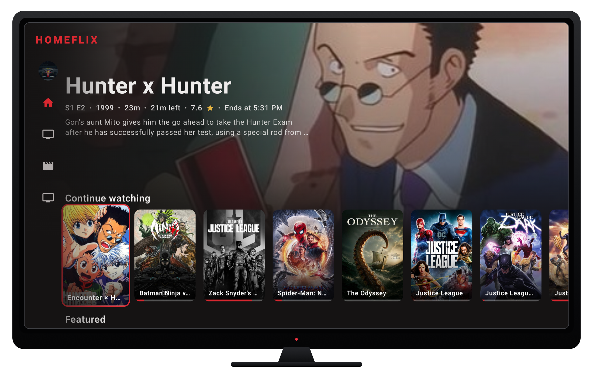
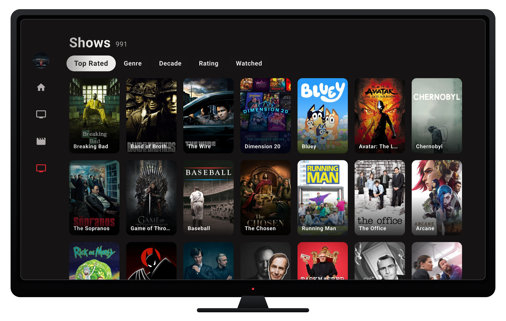
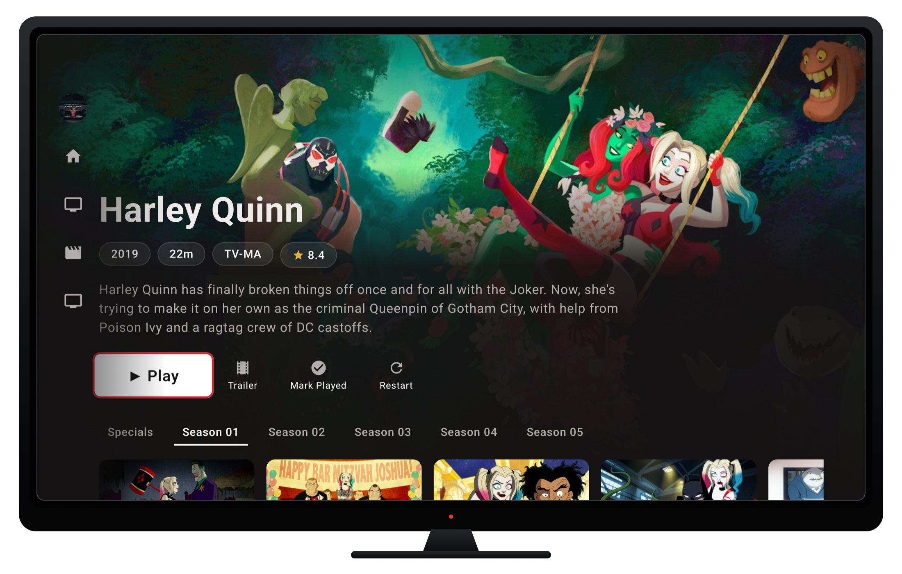

<p align="center">
  
</p>

<h1 align="center">Homeflix for Android TV</h1>

<p align="center">
  Homeflix is a native Android TV client for a self-hosted media library. It uses the Jellyfin API for browsing and sessions, plus a small playback extension for source selection and stream preparation.
</p>

## Stack

Kotlin 2.3 · Jetpack Compose · Compose for TV · Media3 · Jellyfin API

## Showcase

### Home

Home combines continue watching, recommendations, recently added media, and a focus-driven hero built for D-pad navigation.

<p align="center">
  
</p>

### Library

Libraries support sorting and filters for genre, decade, rating, and watch status in a paged poster grid.

<p align="center">
  
</p>

### Details

Details include metadata, playback actions, seasons, episodes, trailers, and watch-state controls.

<p align="center">
  
</p>

## Requirements

- A Jellyfin-compatible backend with the playback extension below
- Android TV 8.0 or newer (API 26)
- JDK 17 and Android SDK Platform 37 for local builds
- Android SDK Build-Tools 36.0.0

### Server API

Homeflix uses the standard Jellyfin API for sign-in, libraries, artwork, episodes, skip segments, and playback sessions. The backend can be a Jellyfin fork, plugin, or adapter.

Playback adds a small extension to `POST /Items/{itemId}/PlaybackInfo` so the backend can select and return a playable source. It may return the source immediately; loading stages are optional.

Optional integrations:

- **Featured feed:** `GET /HomeFlix/Recommendations` supplies ranked `{ ItemId, Rank }` entries.
- **Loading stages:** `GET /Playback/PipelineProgress` reports preparation progress before Media3 receives the stream.
- **Bug monitoring:** `POST /ClientLog/PlaybackPipeline` records source selection, player state, and failures. Reporting failures do not stop playback.

## Run

Supply one or more comma-separated server URLs at build time. The value stays outside tracked source.

```bash
cd apps/android-tv

# build and install on a connected TV or emulator
HOMEFLIX_SERVER_URLS=http://your-jellyfin-host:8096 ./gradlew installDebug

# full local quality gate
./gradlew ktlintCheck detekt lintDebug testDebugUnitTest assembleDebug

# connected Compose tests
./gradlew connectedDebugAndroidTest

# scoped PIT mutation tests
./gradlew \
  :core:designsystem:pitestDebug \
  :core:network:pitestDebug \
  :core:session:pitestDebug \
  :feature:auth:pitestDebug \
  :feature:detail:pitestDebug \
  :feature:home:pitestDebug \
  :feature:profile:pitestDebug
```

The checked-in Gradle wrapper downloads Gradle 9.4.1. Gradle also accepts `-PhomeflixServerUrls=http://your-jellyfin-host:8096`.

## License

Homeflix source code is available under the [Mozilla Public License 2.0](../../LICENSE). Showcase media is covered by [NOTICE](../../NOTICE.md).
