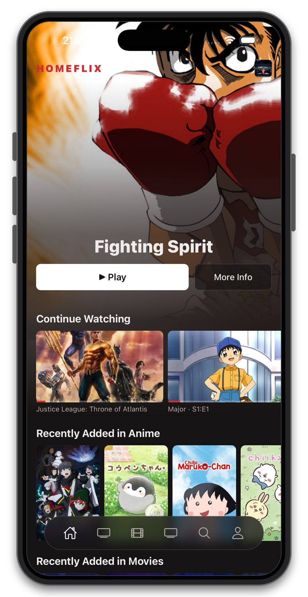
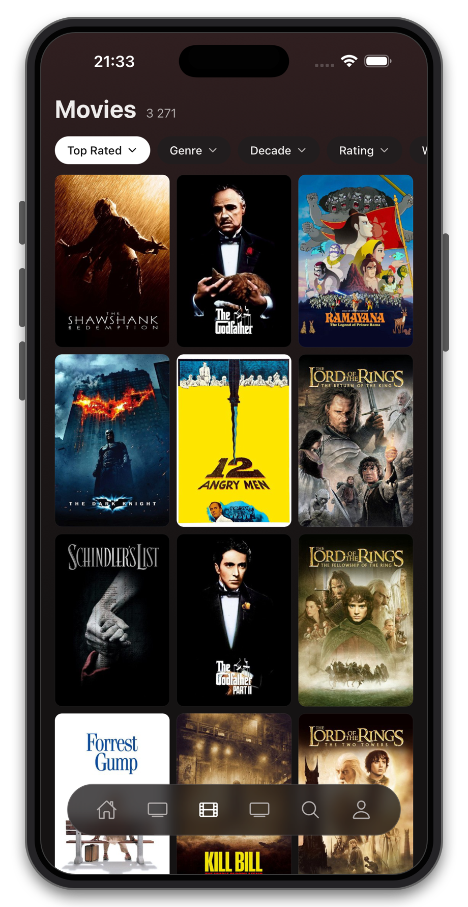
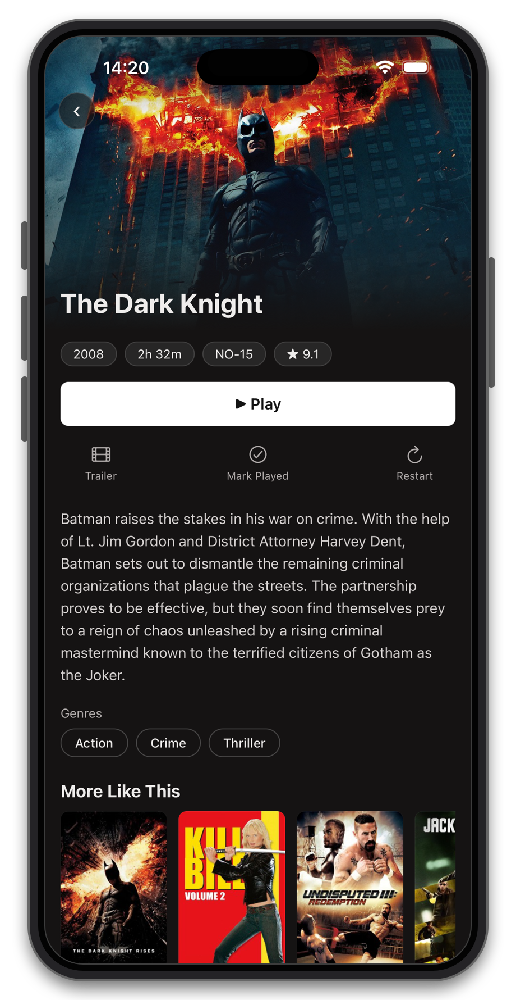
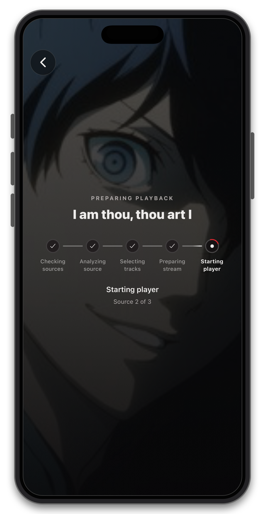
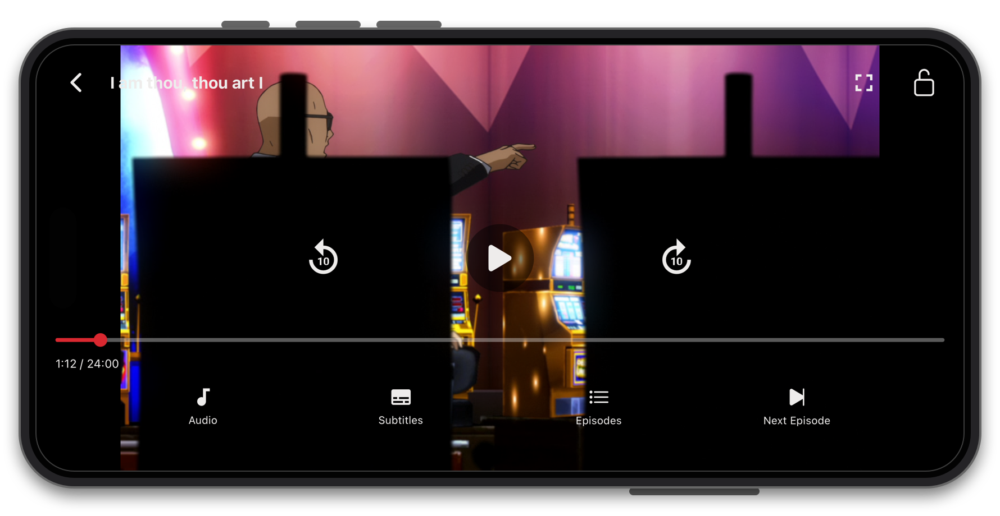
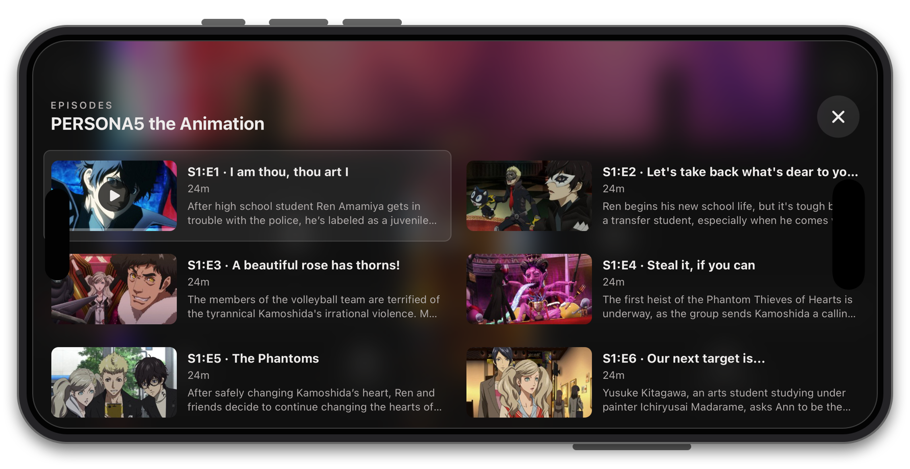

<p align="center">
  
</p>

<h1 align="center">Homeflix for iOS</h1>

<p align="center">
  Homeflix is an iPhone video client for a self-hosted media library. It uses the Jellyfin API for the library and a small playback extension for source selection and stream preparation.
</p>

## Stack

React Native 0.86 · React 19 · Expo 57 · Expo Router · Expo Video · Jellyfin API

## Showcase

### Home

Recommendations, recently added media, and in-progress titles from the connected library.

<p align="center">
  
</p>

### Library

The movie library supports sorting and filters for genre, decade, rating, and watch status.

<p align="center">
  
</p>

### Movie details

Details combine metadata, playback actions, an overview, genres, and related titles.

<p align="center">
  
</p>

### Playback pipeline

The pipeline view follows the stages reported for the current playback request, then hands the playable stream to the native player.

<p align="center">
  
</p>

### Player

The native player handles seeking, play and pause, screen fit, control locking, audio, subtitles, and next-episode playback.

<p align="center">
  
</p>

### Episodes

The episode picker shows the current and following episodes with artwork, runtime, and summaries without leaving playback.

<p align="center">
  
</p>

## Requirements

- A Jellyfin-compatible backend with the playback extension below
- Network access from the iPhone to the backend
- An iOS signing and sideloading setup

### Server API

Homeflix uses the standard Jellyfin API for sign-in, browsing, artwork, episodes, skip segments, and playback sessions. The backend can be a Jellyfin fork, plugin, or adapter.

Playback adds a small extension to `POST /Items/{itemId}/PlaybackInfo` so the backend can select and return a playable source. It may return the source immediately; loading stages are optional.

Optional integrations:

- **Home and Search feed:** `GET /HomeFlix/Recommendations` supplies ranked `{ ItemId, Rank }` entries. Another feed can be selected in `src/api/recommendations/recommendations.js`.
- **Catalog search:** Extend `/Items` with another server-managed catalog. Opening a result must return a normal Jellyfin item from `GET /Users/{userId}/Items/{itemId}` so its details can load.
- **Loading stages:** `GET /Playback/PipelineProgress` shows detailed preparation progress. Without it, the app shows a general loading state.
- **Bug monitoring:** `POST /ClientLog/PlaybackPipeline` records source and track selection, player state, and failures. Reporting failures do not stop playback.

## Run

Create the ignored local configuration file, then add one or more comma-separated server URLs to `EXPO_PUBLIC_HOMEFLIX_SERVER_URLS`.

```bash
cd apps/ios
cp .env.example .env.local
pnpm install
pnpm ios

pnpm start
pnpm check
```

## Unsigned build

```bash
cd apps/ios
pnpm exec expo prebuild --platform ios
cd ios
pod install
xcodebuild build \
  -workspace Homeflix.xcworkspace \
  -scheme Homeflix \
  -configuration Release \
  -sdk iphoneos \
  -derivedDataPath ../build \
  CODE_SIGNING_ALLOWED=NO
```

CI packages the unsigned app as `Homeflix.ipa` on pushes to `main`. Sign and install it with an iOS sideloading tool.

## License

Homeflix source code is available under the [Mozilla Public License 2.0](../../LICENSE). Showcase media is covered by [NOTICE](../../NOTICE.md).
